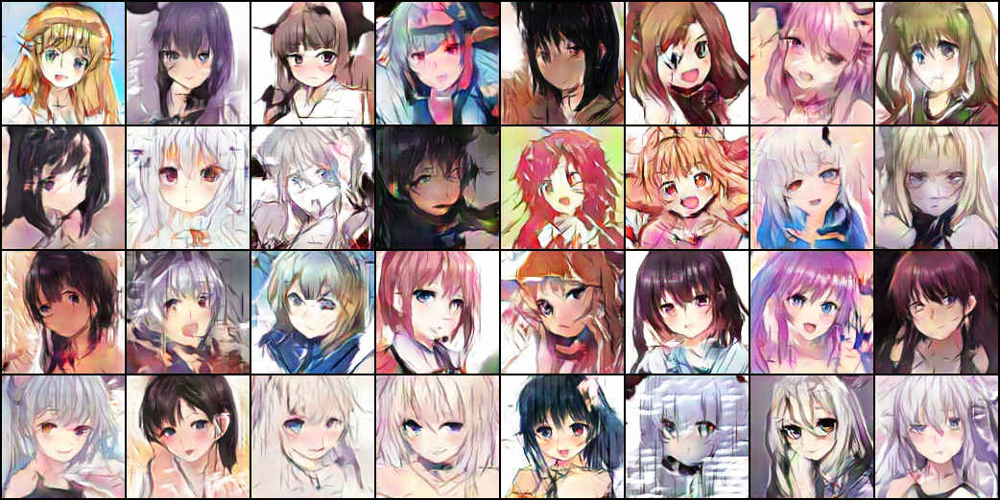

# FCC-GAN
## A Pytorch implementation of FCC-GAN

This implementation is based off of the model in the "FCC-GAN: A Fully Connected and Convolutional Net Architecture for GANs" paper (https://arxiv.org/abs/1905.02417)

I used WGAN-GP training to train the model.

This implementation only works with 128x128 images. I have a 64x64 model called `Gen64` and `Disc64` in `model.py`, if you want to use 64x64 images. Although, you have to implement that yourself.

## Results

These are the results after 264 epochs of training.

I used downscaled 128x128 images from the "another anime face dataset" dataset for training (https://www.kaggle.com/scribbless/another-anime-face-dataset).

## Variable Usage
All the training variables are located in the top of `train.py` under the `# Hyper-parameters` comment. The default values are the values I used for training on a GTX 1060 with 6 GB of VRAM.

### General Training Parameters
 - `TOTAL_EPOCS` - The total amount of epochs to train for.
 - `BATCH_MULTIPLIER` - The multiplier to the base batch size of 64. For example, `BATCH_MULTIPLIER = 1` -> `BATCH_SIZE = 64`; `BATCH_MULTIPLIER = 2` -> `BATCH_SIZE = 128`.
 - `BATCH_SIZE` - The batch size. I would suggest changing `BATCH_MULTIPLIER` instead of `BATCH_SIZE`, because `BATCH_MULIPLIER` affects learning rate, to hopefully yield better results, and just changing `BATCH_SIZE` directly could hurt performance.

### Image Settings
 - `IMG_CHANNELS` - The amount of image channels.

### Optimizer Parameters
 - `LR` - The learning rate.
 - `BETAS` - The beta values for Adam.

### Generator parameters
 - `GEN_FEATURES` - The number of features the generator has.
 - `Z_SIZE` - The size of the latent vector (also known as the z dimension or random noise).

### Discriminator Parameters
 - `DISC_FEATURES` - The number of features the discriminator has.
 - `DISC_ITERATIONS` - The number of iterations to optimize the discriminator per batch.
 - `LAMBDA_GP` - The lambda value for gradient penalty.

### Model Saving Parameters
 - `LOAD_MODEL` - This dictates whether or not to load the model saved at the `MODEL_FP` path.
 - `MODEL_FP` - The file path to save the model checkpoints.
 - `TRAINING_INFO_FP` - The file path to save the training info (fixed noise data and current global Tensorboard step).

### Dataset Parameters
 - `DATASET_PATH` - The folder path to a valid ImageFolder dataset. Don't be like me, and forget to put the images in a folder called "images" inside the root dataset directory.

### Tensorboard Parameters
 - `STEP_SIZE` - The amount of batches per global Tensorboard step. Keep in mind, every global Tensorboard step the Tensorboard log is updated, model checkpoints, and the training info are saved.
 - `LOG_DIR_PATH` - The folder path to store the Tensorboard logs in.
